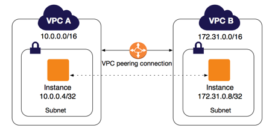

# Exadel Internship


## Task 1. Git

* log.txt
* status.txt

## Task 2. AWS/Clouds

1. [WebServer Link](http://ec2-3-120-189-89.eu-central-1.compute.amazonaws.com/ "AWS Intership Example page")
2. The environment is deployed with terraform (./task2/aws)
    * BASH script for installing a web server in this folder as well (./task2/aws/client_data.sh)
    * Primary and secondary VPCs are connected using VPC peering

    

## Task 3. Docker

1. Bash script for installing Docker and environment ([./task3/1-environment/install_docker.sh](https://github.com/AVShutov/internship/blob/master/task3/1-environment/install_docker.sh))

2. Image with html page ([./task3/2-Image/index.html](https://github.com/AVShutov/internship/blob/master/task3/2-Image/index.html))

```bash
docker run -d --name my-apache-app -p 8080:80 -e -v "$PWD"/index.html:/usr/local/apache2/htdocs/index.html httpd:2.4
```

3. Clear basic image - CentOS. An environment variable DEVOPS=username passed inside container to a web page with simple PHP code
    * [./task3/3-Dockerfile](https://github.com/AVShutov/internship/tree/master/task3/3-Dockerfile) or with command&nbsp;

    ```bash
    docker run -d --name my-apache-app -p 8080:80 -e DEVOPS=$(echo $USER) -v "$PWD"/index.html:/usr/local/apache2/htdocs/index.html httpd:2.4
    ```

4. Created GitHub Action to DockerHub for each push.
    * https://hub.docker.com/repository/docker/shutoffalexey/my-httpd
5. Created docker-compose with env files ([./task3/5-docker-compose](https://github.com/AVShutov/internship/tree/master/task3/5-docker-compose))
## Task 4. Ansible

1. Infrastructure deployed with terraform (https://github.com/AVShutov/internship/tree/master/task4-ansible/1-environment). Ansible and it's dependensies installed with "remote-exec" provisioner. Repo with playbooks git cloned to the Control plane machine.

```terraform
  provisioner "remote-exec" {
    inline = [
      "sudo yum update -y",
      "sudo yum install -y curl git mc",
      "pip3 install --user ansible paramiko docker-compose boto3 botocore",
      "ansible-galaxy collection install amazon.aws",
      "ansible-galaxy collection install community.docker",
      "git clone https://github.com/AVShutov/internship.git",
      "sudo chmod 400 ~/.ssh/frankfurt_key.pem"
    ]
```

2. The Docker deployment playbook is here (https://github.com/AVShutov/internship/tree/master/task4-ansible/lamp). LAMP cloned during installation from third party free repository (thanks man!). Secrets are encrypted with Ansible-vault and transferred with jinja2 template to the executable VMs.

```yaml
$ ansible-vault encrypt ./vault.yml --vault-password-file ~/.ansible/vault.txt
```

```yaml
$ ansible-playbook -i ~/internship/task4-ansible/lamp/inventory/lamp_aws_ec2.yml lamp_install.yml --vault-password-file "~/.ansible/vault.txt" -vv
```

3. Used EC2 dynamic inventory source plugin. To install it use: ```ansible-galaxy collection install amazon.aws```.

```ini
ansible.cfg
[inventory]
enable_plugins = aws_ec2
```

```yaml
$ ansible-inventory -i ~/internship/task4-ansible/lamp/inventory/lamp_aws_ec2.yml --graph

$ansible-inventory -i ~/internship/task4-ansible/lamp/inventory/lamp_aws_ec2.yml --list
```

## Task 5. Jenkins

1. Jenkins deployed with Ansible playbook (https://github.com/AVShutov/internship/blob/master/task5-jenkins/jenkins/jenkins_install.yml) in Docker using Dockerfile (https://github.com/AVShutov/internship/blob/master/task5-jenkins/jenkins/Dockerfile) for this.

2. Docker Registry deployed with docker-compose (https://github.com/AVShutov/internship/blob/master/task5-jenkins/jenkins/docker-compose.yml)

3. Jenkinsfile (https://github.com/AVShutov/internship/blob/master/task5-jenkins/jenkins/Jenkinsfile)
    * PASSWORD variable passed into container with standart Jenkiks Credentials module

4. Integration between GitHub and Jenkins is configured using a standard GitHub Webhook and Embeddable Build Status plugin that shows the status of the last build as an icon.

[](http://ec2-3-68-158-210.eu-central-1.compute.amazonaws.com:8080/job/Docker/)

## Task 6. Databases

1. SQL script that will fill the Database and check for the presence of existing tables/records is wrapped in a bash script (https://github.com/AVShutov/internship/blob/master/task6-db/postgresql/roles/master/files/init-db.sh) that is launched when the docker container with the Postgres Master starts. This script creates a database, tables, fills it with data from CSV files (https://github.com/AVShutov/internship/tree/master/task6-db/postgresql/roles/master/files), and also creates a user and a slot for replication.

2. A request that will find information about completed tasks

```bash
$ psql -h localhost -U postgres task6_db -c "SELECT Students.Student, task1, task2, task3, task4, task5 FROM Students,result where Students.StudentId=result.StudentId AND Students.Student ~ 'Шутов'";
```

3. Dump the database, delete the existing one and restore from the dump. 

```bash
$ export PGPASSWORD="$POSTGRES_PASSWORD"

$ pg_dump -h localhost -p 5432 -w -U postgres -n public -F t -b -E UTF8 -f /opt/db_backup/task6_db.backup task6_db

$ dropdb -h localhost -p 5432 -U postgres -w -f --if-exists task6_db

$ createdb -h localhost -p 5432 -U postgres -w task6_db

$ pg_restore -h localhost -p 5432 -d task6_db -U postgres -v /opt/db_backup/task6_db.backup
```

4. Ansible role for creating a SQL cluster (master/slave).<br>
https://github.com/AVShutov/internship/tree/master/task6-db/postgresql

5. Jenkins Pipeline for Ansible roles.<br>
https://github.com/AVShutov/internship/blob/master/task6-db/postgresql/Jenkinsfile

## Task 7. Monitoring

1. Zabbix installed with Ansible role (https://github.com/AVShutov/internship/tree/master/task7-monitoring/roles/zabbix)


2. MySQL DB Dashboard


3. ICMP check

