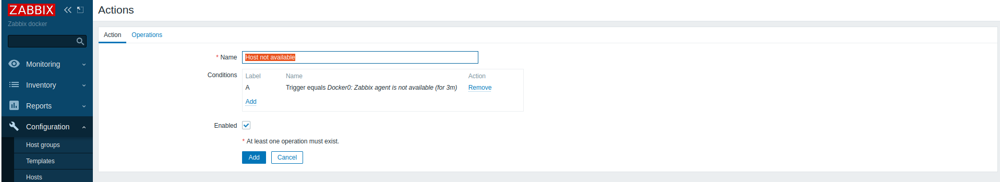
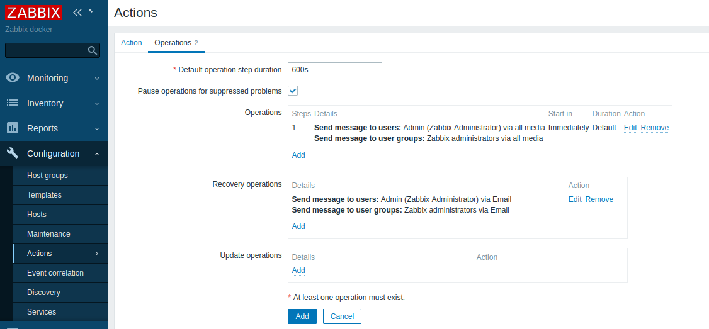
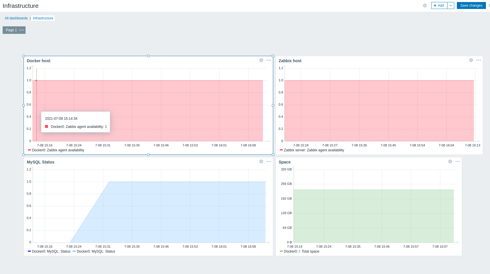
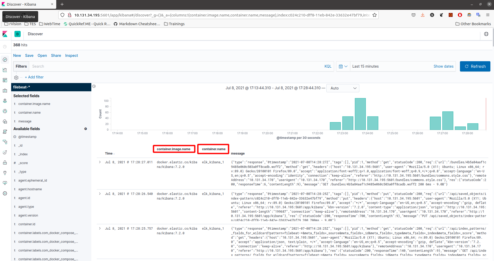
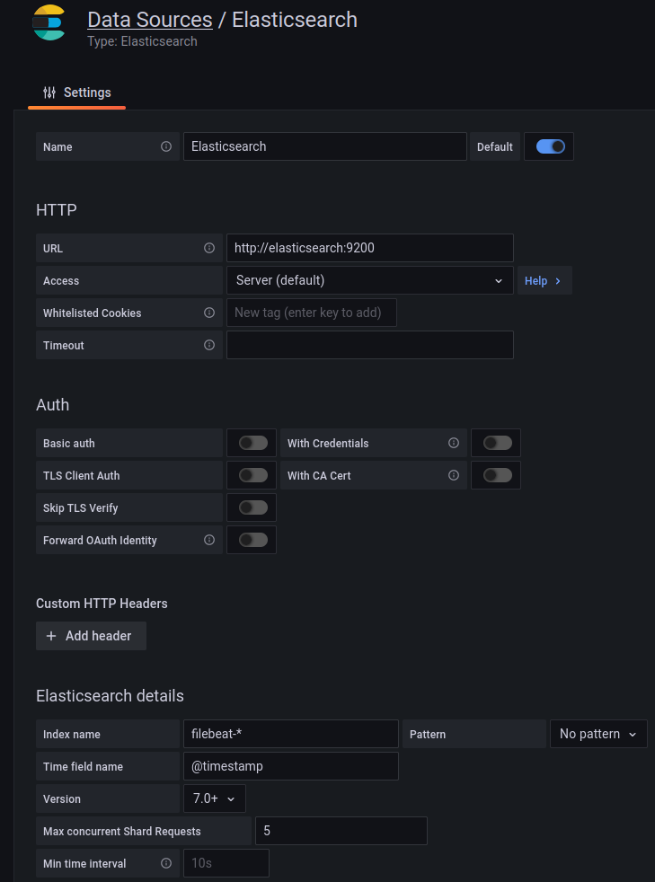
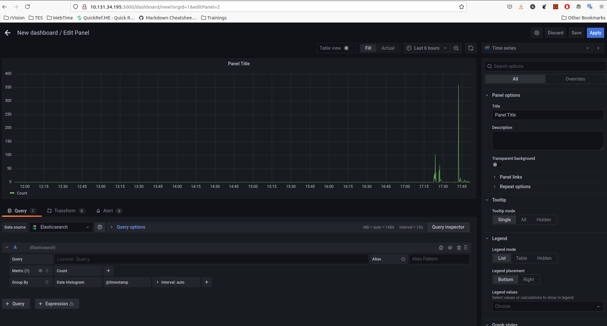

## Task 7. Monitoring

### Zabbix

1. Zabbix installed with Ansible role (https://github.com/AVShutov/internship/tree/master/task7-monitoring/roles/zabbix)

```bash
CONTAINER ID   IMAGE                                              COMMAND                  CREATED          STATUS             PORTS                                                                            NAMES
94b85aad4184   zabbix/zabbix-agent2:5.4.2-alpine                  "/sbin/tini -- /usr/…"   16 minutes ago   Up 16 minutes      0.0.0.0:10050->10050/tcp, :::10050->10050/tcp, 31999/tcp                         zabbix-agent
310037d61b4b   zabbix/zabbix-web-apache-mysql:ubuntu-5.4-latest   "docker-entrypoint.s…"   18 hours ago     Up About an hour   0.0.0.0:80->8080/tcp, :::80->8080/tcp, 0.0.0.0:443->8443/tcp, :::443->8443/tcp   zabbix-frontend
750428690c94   zabbix/zabbix-server-mysql:ubuntu-5.4-latest       "/usr/bin/tini -- /u…"   18 hours ago     Up About an hour   0.0.0.0:10051->10051/tcp, :::10051->10051/tcp                                    zabbix-server
39b9ae78525f   mysql:5.7                                          "docker-entrypoint.s…"   18 hours ago     Up About an hour   0.0.0.0:3306->3306/tcp, :::3306->3306/tcp, 33060/tcp                             mysql

```


2. MySQL DB Dashboard


3. ICMP check


4. Actions




5. Infrastructure Dashboard



### ELK

1. ELK deployed by docker compose with FILEBEAT (https://github.com/AVShutov/internship/tree/master/task7-monitoring/ELK) which sends his own ELK docker logs to ...ELK )



### Grafana

1. Grafana deployed as a part of ELK compose. Datasource and poor Dashboard...



